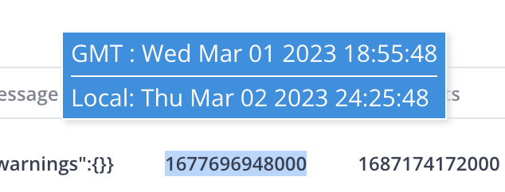

<h1 align="center">Epoch converter</h1>

*Epoch converter is a web browser extension to help convert epoch time to string format by selecting the text*

### Installation Instructions
1. Download this repo
2. You should have a folder named `hevo-epoch-converter`.
3. In Chrome go to the extensions page (`chrome://extensions`).
4. Enable Developer Mode.
5. Drag the `hevo-epoch-converter` folder anywhere on the page to import it (do not delete the folder afterward).

#### Usage
You can select any text that is in epoch format and a pop up will be shown with timestamp in stirng format for local and GMT time
 